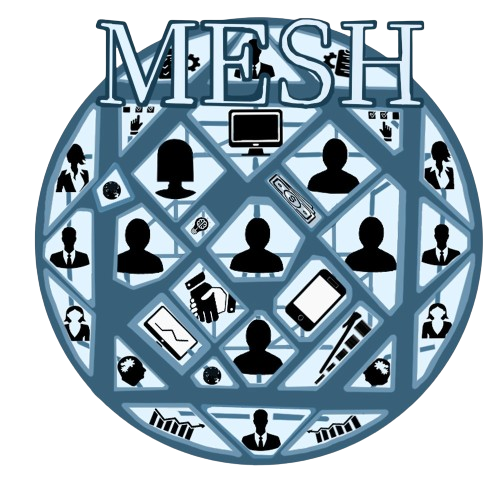

# 🌐 Rede Social Corporativa Mesh

Sistema web desenvolvido para simular uma rede social interna voltada ao ambiente corporativo, com funcionalidades de interação, publicação, bate-papo e perfil de usuários.

---

## 📌 Funcionalidades Principais

- ✅ Sistema de login e cadastro de usuários
- ✅ Criação de publicações com possibilidade de curtir e republicar
- ✅ Bate-papo em tempo real entre usuários
- ✅ Pesquisa de usuários e sistema de seguir/deixar de seguir
- ✅ Perfil personalizado com foto, nome e informações adicionais
- ✅ Histórico de interações e leaderboard (placar de usuários)
- ✅ Interface com navegação intuitiva e responsiva

---

## 🗂️ Estrutura do Projeto

- **Front-end**: HTML5, CSS3, JavaScript
- **Back-end**: PHP
- **Banco de dados**: MySQL
- **Recursos adicionais**:
  - Gerenciamento de sessões de usuário
  - Requisições assíncronas com AJAX
  - Modularização por telas: feed, chat, perfil, jogos etc.

---

## 🛠️ Tecnologias Utilizadas

- **HTML5**
- **CSS3**
- **JavaScript (Vanilla JS)**
- **PHP**
- **MySQL**
- **Visual Studio Code**

---

## 📁 Estrutura de Arquivos

- `index.html`: tela principal
- `login.html`, `cadastro.html`: autenticação de usuário
- `chamar_*.html`: navegação entre módulos
- `batepapo.php`, `carregar_mensagens.php`: mensagens em tempo real
- `publicar.php`, `toggle_like.php`: interações com publicações
- `conexao.php`: conexão com o banco de dados MySQL
- Diretórios `assets/`, `images/`: imagens e ícones

---

## 📝 Observações

Este projeto foi desenvolvido como parte de um trabalho acadêmico do **segundo semestre** no curso de **Desenvolvimento de Software Multiplataforma**. O objetivo é integrar habilidades de front-end, back-end e banco de dados em uma aplicação web funcional e realista.

---

## 📸 Imagens

